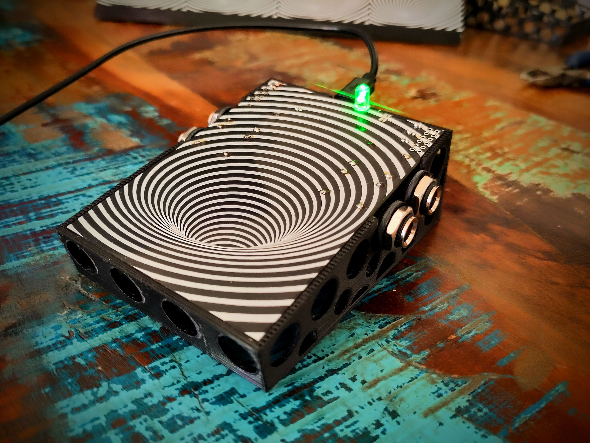

# Tone Ale
Reprogrammable rp2040 based guitar pedal with capacitive touch sensing. Some effects are toggled on and off by tapping on the pedal surface, others act as expression pedals by increasing and decreasing the pressure/surface area you apply to the pedal.

## Effects:
* audio interface
  * 2 input 2 output usb audio interface. Tap on pedal surface to mute/unmute it. LED indicates mute status. Only 48kHz 32bit audio supported.
* cabinet simulator
  * Guitar cabinet simulator using an impulse response.
* delay
  * Stereo digital delay. Each repeat is half the volume of the previous. Set feedback to false for only one repeat. Change delay buffer size for a different delay time. set it to an odd number for ping pong delay.
* fuzz
  * Simple fuzz. Turn on the gate for a tight velcro sound. Change the gain and clipping levels to taste.
* low pass filter
  * Always on low pass filter. Cuttoff frequency is determined by pressure applied to pedal. When not touching the pedal the cuttoff frequency should be higher than audible range so it is as if there is no filter.
* phaser
  * phaser effect with various parameters that can be tuned in code.
* rig
  * fuzz and cabinet simulator together in one effect which kind of gives the sound of a full guitar rig.
* sample player (amen beat)
  * sample starts playing when you place your foot on the pedal and stops when you take it away. It restarts from the beginning everytime. Increasing and decreasing the pressure/surface area changes the volume.
* sample rate reducer
  * By default the sample rate is 48kH and there is no aliasing. By stepping on the pedal you decrease the sample rate and introduce aliasing artifacts. The harder you press the more the sample rate drops.
* unstable noise generator
  * Unstable IIR filter. It chaotically generates weird sounds which are effected by the input in unpredictable ways.
* vibrato
  * pitch shifting vibrato
* wah
  * classic band pass filter wah sound. It engages when you step on the pedal and then you control the wah using pressure. As soon as you remove your foot it outputs the dry signal again.
* wavefolder
  * Similar to fuzz, except instead of clipping it folds the part of the signal above the threshold back down.

 

## Where to get one?
Everything necesary to build your own Tone Ale is available on this repository, but if you want to buy a fully assembled Pedal send an email to toneagetechnology@gmail.com. Profits are donated to effective charities.

Pedals will be sold for CHF125. In spirit of full transparency, I will share that my production cost per pedal is between CHF20 and CHF30 depending on a few varying factors. It would likely cost you more. It's cheaper for me since I'm producing it in bulk and already have a lot of the tools required. I will assume it's a fixed CHF25 and donate CHF100 for every pedal sold. This production cost does not include my time/labour, because that is done pro bono.

For questions about my charity selection process, motivation for doing this, or if you have a prefered charity you want payment for your pedal donated to, you can also email toneagetechnology@gmail.com.

## Upload new effect
You don't need to be able to develop or install special software to upload new effects. All you need is a usb port, cable, and something conductive (a piece of tin foil will to).

To upload new effects, connect the pedal to a computer with a usb cable, touch the part of the pcb shown in the image below with a piece of tin foil and drag it to the side as shown. Now the pedal shows up as a mass storage device. Just drag and drop the uf2 file(found in /compiled_effects) of the corresponding effect and you're all set to go.

## Compile effects
Perhaps you want to alter some effects before uploading it onto the pedal. For example you might want to increase the gain of the fuzz. This would require recompiling the effect after the changes to the code have been made. Follow the steps below to recompile:

First set up the Pi Pico SDK according to [this guide](https://www.raspberrypi.com/documentation/microcontrollers/c_sdk.html#sdk-setup)

Open terminal in the main project folder (called tone_ale) and run the following commands:

`cp <pico_sdk_path>/external/pico_sdk_import.cmake .` (replace <pico_sdk_path> with wherever you set up the SDK)

`cd /build`

`cmake ..`

`make`

This will compile each effect and place it in "/build/<effect_name>/<effect_name>.uf2". This uf2 file can then directly be uploaded onto the pedal using the method descibed above

## Develop new effects
TODO explain this

## Pinout
The pinout is shown below.
* POT0, POT1, POT2 and POT3 can be programmed as analog inputs, so they can be used for adding potentiometers (knobs)
* GP0, GP1, GP2, GP3, GP4, GP5 and GP6 are general purpose digital input/output pins, so they can be used for many different things including LEDs, buttons, digitally communicating with external devices such as displays etc.
* If you want to chain multiple Tone Ale's together, you can reduce cost and improve fidelity by not putting DACs and ADCs between them and just directly connect their VBUS, GND, I2CV_CLK, I2CV_WS and connect the I2CV_OUT from the first pedal to the I2CV_IN of the second. You can chain many pedals together in this way (it's been tested up to 4). NB: Only the first pedal in the chain should have an PCM1808 soldered on, otherwise the I2CV_CLK and I2CV_WS will be driven by multiple sources. Alternatively you can run a different firmware on all pedals except the first one in the chain where the PCM1808 does not generate a clock. (TODO: explain how to do this)

