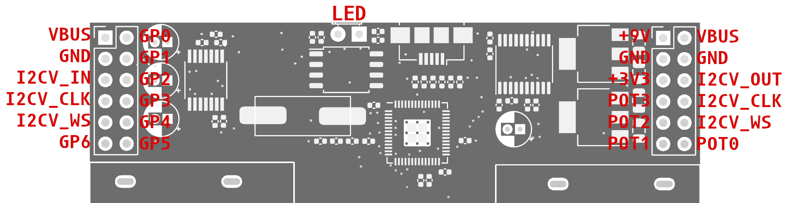

# Tone Ale
Reprogrammable rp2040 based guitar pedal with capacitive touch sensing. Currently it can be programmed as an audio interface, cabinet simulator, delay, fuzz, low pass filter, phaser, rig (amp + cab sim), sample rate reducer, unstable noise generator, vibrato, wah and wavefolder. Some effects are toggled on and off by tapping on the pedal surface, others act as expression pedals by increasing and decreasing the pressure/surface area you apply to the pedal.

 

## Upload new effect
You don't need to be able to develop or install special software to upload new effects. All you need is a usb port, cable, and something conductive (a piece of tin foil will to).

To upload new effects, connect the pedal to a computer with a usb cable, touch the part of the pcb shown in the image below with a piece of tin foil and drag it to the side as shown. Now the pedal shows up as a mass storage device. Just drag and drop the uf2 file of the corresponding effect and you're all set to go.

## Compile effects
Perhaps you want to alter some effects before uploading it onto the pedal. For example you might want to increase the gain of the fuzz. This would require recompiling the effect after the changes to the code have been made. Follow the steps below to recompile:

First set up the Pi Pico SDK according to [this guide](https://www.raspberrypi.com/documentation/microcontrollers/c_sdk.html#sdk-setup)

Open terminal in the main project folder (called tone_ale) and run the following commands:

`cp <pico_sdk_path>/external/pico_sdk_import.cmake .` (replace <pico_sdk_path> with wherever you set up the SDK)

`cd /build`

`cmake ..`

`make`

This will compile each effect and place it in "/build/<effect_name>/<effect_name>.uf2". This uf2 file can then directly be uploaded onto the pedal using the method descibed above

## Develop new effects
TODO explain this

## Pinout
The pinout is shown below. POT0, POT1, POT2 and POT3 can be programmed as analog inputs, so they can be used for adding potentiometers (knobs). GP0, GP1, GP2, GP3, GP4, GP5 and GP6 are general purpose digital input/output pins, so they can be used for many different things including LEDs, buttons, digitally communicating with external devices such as displays etc. If you want to chain multiple Tone Ale's together, you can reduce cost and improve fidelity by not putting DACs and ADCs between them and just directly connect their VBUS, GND, I2CV_CLK, I2CV_WS and 
connect the I2CV_OUT from the first pedal to the I2CV_IN of the second. You can chain many pedals together in this way (it's been tested up to 4). NB: The line `tone_ale_clk_setup(SAMPLE_RATE, SYSTEM_CLK);` has to be commented out for all pedals except the first one in the chain, otherwise their clocks will conflict with each other.

## Hardware setup
TODO explain what to solder where for people building their own pedal
